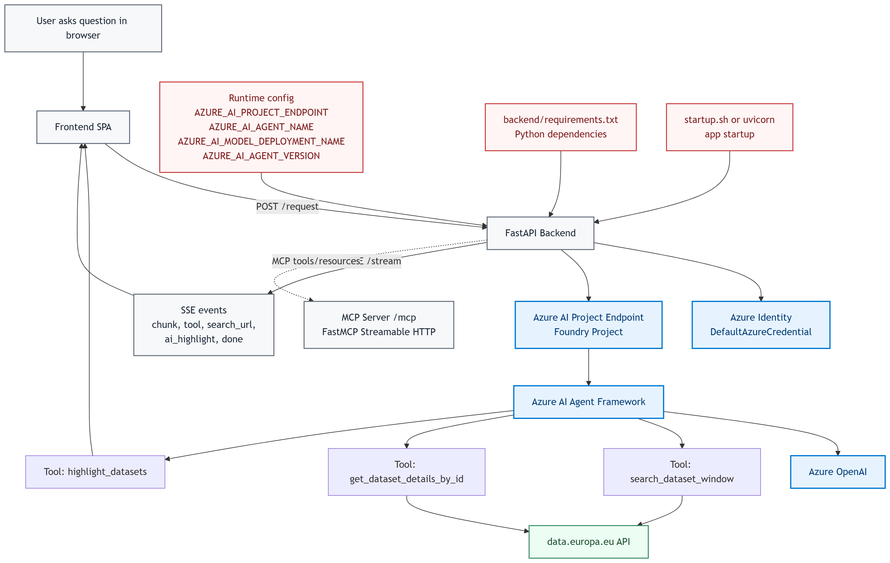
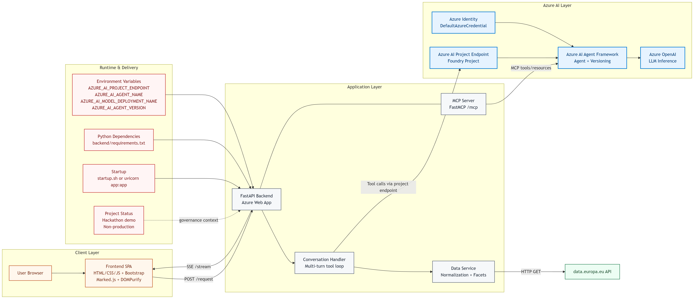
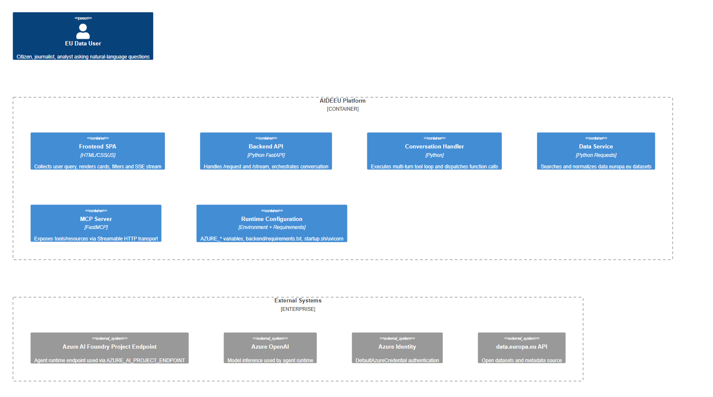

# AIDEEU — AI Data Explorer EU


**Ask a question in plain language and let the on-page AI agent explore 1.5 million EU datasets for you. Powered by Azure AI Agent Service and Model Context Protocol.**

> Built by **Inari Solutions Sp. z o.o.** for the Microsoft AI Dev Days Hackathon 2026

---

## The Problem: A Data Democratization Gap

The European Union has made a historic commitment to open data. Through directives like the [Open Data Directive (2019/1024)](https://eur-lex.europa.eu/eli/dir/2019/1024/oj) and the [Data Governance Act](https://eur-lex.europa.eu/eli/reg/2022/868/oj), the EU mandates that publicly funded data should be freely available to everyone. The official portal — [data.europa.eu](https://data.europa.eu) — now holds over **1.5 million datasets** from **27 member states**, covering everything from air quality and gender pay gaps to public procurement and renewable energy.

**The data is open. But open does not mean accessible.**

Despite the EU's investment in open data infrastructure, a fundamental democratization gap persists. The portal requires precise keyword searches, SPARQL queries, knowledge of metadata schemas, and manual navigation through complex faceted filters. This creates a two-tier system:

- **Data professionals** (with technical skills) can extract value from the portal
- **Everyone else** — journalists investigating public spending, teachers preparing lessons, small business owners researching market conditions, citizens holding governments accountable — is effectively locked out

The result is a paradox: **data that was made open to empower all citizens is accessible only to the few who already have technical expertise.** Billions of euros in publicly funded data sit underutilized, and the promise of data-driven transparency, innovation, and evidence-based policymaking goes unfulfilled.

---

## Our Solution

AIDEEU bridges the data democratization gap by replacing technical barriers with **natural conversation**. Instead of learning SPARQL or navigating complex metadata schemas, any citizen can simply ask a question in their own words through the website's AI agent and get structured, AI-curated results.

This is what true data democratization looks like: **not just making data open, but making it genuinely usable by everyone.**

The on-page agent guides users through a **4-step workflow**:

| Step | What Happens |
|------|-------------|
| **1. Ask** | Type your question in natural language — e.g., *"How do EU countries rank on renewable energy spending?"* |
| **2. Refine** | The AI agent discusses your intent, builds optimized search queries, and narrows down the right datasets |
| **3. Explore** | Browse structured results with country flags, format indicators, faceted filters, and AI-highlighted recommendations |
| **4. Summarize** | Get AI-generated insights about specific datasets without downloading them |

The agent autonomously decides which tools to call, how to interpret results, and when to refine its approach — a true agentic experience that transforms the EU's open data promise into an accessible reality.

---

## Demo Video

> **[Watch AIDEEU in action](https://youtu.be/dsT4qMRvsOk)** — from a plain-language question to AI-highlighted dataset recommendations in under 60 seconds.

---

## Architecture

The diagrams below present the end-to-end flow, logical system architecture, and C4 container view used in AIDEEU.

### Architecture Diagrams

- **Flowchart**
    
- **Architecture**
    
- **C4 Container**
    

### Request Flow

1. **User** types a natural-language question in the browser (pure HTML/CSS/JS SPA)
2. **Frontend** sends a POST request to `/request` on the FastAPI backend hosted on **Azure Web App**
3. **Backend** authenticates via **Azure Identity** (`DefaultAzureCredential`) and routes the request to the **Azure AI Agent Framework** through the **Azure AI Project endpoint** (`AZURE_AI_PROJECT_ENDPOINT`, `azure-ai-projects` SDK)
4. The **Azure AI Agent** (powered by **Azure OpenAI**) reasons about the query and autonomously calls registered tools:
   - `search_dataset_window` — searches the data.europa.eu API with intelligent query building, facet filtering, and up to 500 results
   - `get_dataset_details_by_id` — fetches complete metadata for a specific dataset
   - `highlight_datasets` — marks AI-recommended datasets for visual emphasis on the frontend
5. Tool results are fed back to the agent in a **multi-turn tool loop** until it produces a final response
6. The response is streamed to the frontend via **Server-Sent Events** (SSE) with custom event types (`chunk`, `done`, `tool`, `search_url`, `ai_highlight`)
7. **MCP Server** (FastMCP, mounted at `/mcp`) exposes the same tools and resources over the **Model Context Protocol**, enabling external agent orchestration

### Microsoft & Azure Services

| Service / SDK | Role in AIDEEU |
|---------|---------------|
| **Azure AI Agent Framework** | Agent creation with versioning, tool registration, conversation management |
| **Azure AI Foundry Project (Agent endpoint)** | Hosts the project endpoint used by the app (`AZURE_AI_PROJECT_ENDPOINT`) |
| **Azure OpenAI** | LLM inference powering the conversational agent (model deployment referenced by `AZURE_AI_MODEL_DEPLOYMENT_NAME`) |
| **Azure Identity** | Secure authentication via `DefaultAzureCredential` |
| **Azure Web App** | Backend hosting and deployment |
| **azure-ai-projects (Python SDK)** | SDK used in backend (`AIProjectClient`, `PromptAgentDefinition`, `FunctionTool`) to create/version/run agents |
| **azure-identity (Python SDK)** | SDK used in backend for `DefaultAzureCredential` authentication |
| **Model Context Protocol (MCP)** | Standardized tool and resource exposure via FastMCP server |
| **VS Code + GitHub Copilot** | Development environment and AI-assisted coding |

---

## Key Features

- **Conversational Dataset Discovery** — Ask questions in natural language; the AI agent searches, filters, and summarizes autonomously
- **Agentic Tool Use** — The agent autonomously decides when and how to call 3 specialized tools based on conversation context
- **Real-Time Streaming** — SSE-based streaming delivers the agent's response token-by-token for instant feedback
- **MCP Server Integration** — All tools are exposed via the Model Context Protocol, enabling multi-agent scenarios and external orchestration
- **AI-Highlighted Recommendations** — The agent marks the most relevant datasets with star indicators, grouped visually above other results
- **Faceted Search with Country Flags** — Interactive filters for country, format, subject, and more; country codes rendered as flag emoji (🇮🇹 🇫🇷 🇩🇪 🇪🇺)
- **4-Step Progress Stepper** — Visual progress indicator (Ask → Refine → Explore → Summarize) guides the user through the workflow
- **Animated Landing Page** — Typewriter placeholder effect, count-up statistics, scroll-reveal cards, and glassmorphism search bar
- **Accessible Design** — Semantic HTML, ARIA labels, `prefers-reduced-motion` support, keyboard navigation
- **Secure Output** — All markdown output sanitized via DOMPurify with a restricted tag/attribute allowlist

---

## Agentic Design

### Single-Agent Architecture with Autonomous Tool Selection

AIDEEU implements a single-agent architecture built on the **Azure AI Agent Framework**. The agent is created with **versioning support** — each deployment tracks semantic versions via `create_version` / `ensure_agent_version`, enabling safe iteration. The agent receives a detailed system prompt defining its role as a search-and-guidance assistant and has access to 3 function tools with strict JSON schema validation.

The agent autonomously decides which tools to call, how to interpret results, and whether to refine the search or present final results to the user — no hardcoded decision trees.

### Multi-Turn Tool Loop

The backend implements a **multi-turn tool execution loop**. After each agent response, the system checks for `function_call` outputs, executes the corresponding tool handler via the data service, feeds results back into the conversation, and re-invokes the agent. This loop continues until the agent produces a final text response with no further tool calls.

This pattern enables complex multi-step reasoning chains — for example: *search → analyze results → refine query → search again → highlight best matches → summarize findings* — all within a single user interaction.

### MCP for Multi-Agent Orchestration

The same tools are exposed via a **FastMCP server** mounted at `/mcp` using the Streamable HTTP transport. This means any MCP-compatible client or agent can connect and use AIDEEU's dataset search capabilities. The MCP server also exposes resources (`system-prompt`, `facets-metadata`), enabling external agents to understand AIDEEU's capabilities before invoking them.

This architecture enables future multi-agent orchestration where external agents can delegate EU data exploration tasks to AIDEEU as a specialized sub-agent.

---

## Tech Stack

### Backend

| Technology | Version | Purpose |
|------------|---------|---------|
| Python + FastAPI | 0.110.0+ | Async web framework with streaming support |
| azure-ai-projects | 2.0.0b1+ | Azure AI Agent Framework SDK |
| azure-identity | 1.15.0+ | Authentication via DefaultAzureCredential |
| FastMCP | 3.1.0+ | Model Context Protocol server |
| Uvicorn | 0.24.0+ | ASGI server |
| requests | 2.31.0+ | HTTP client for data.europa.eu API |

### Frontend

| Technology | Version | Purpose |
|------------|---------|---------|
| HTML5 / CSS3 / JavaScript | ES6+ | Pure SPA — no framework overhead |
| Bootstrap | 5.3.3 | Responsive layout and components |
| Marked.js | latest | Markdown rendering for agent responses |
| DOMPurify | 3.1.7 | XSS protection for rendered content |
| DM Sans + JetBrains Mono | — | Typography via Google Fonts |

---

## Getting Started

### Prerequisites

- Python 3.10+
- Azure subscription with:
  - Azure AI Project provisioned
  - Azure OpenAI model deployed

### Backend Setup

```bash
cd backend
python -m venv antenv
source antenv/bin/activate   # Windows: antenv\Scripts\activate
pip install -r requirements.txt

# Set required environment variables
export AZURE_AI_PROJECT_ENDPOINT="your-project-endpoint"
export AZURE_AI_AGENT_NAME="your-agent-name"
export AZURE_AI_MODEL_DEPLOYMENT_NAME="your-model-deployment"
export AZURE_AI_AGENT_VERSION="your-agent-version"

# Start the server
uvicorn app:app --host 0.0.0.0 --port 8000 --reload
```

Alternatively, use the provided `startup.sh` script.

### Frontend Setup

```bash
# From the repository root
python -m http.server 8080 --directory frontend
# Open http://localhost:8080
```

> **Note:** Update `API_BASE` in `frontend/app.js` if running the backend on a different URL than the default Azure endpoint.

### Optional Configuration

| Variable | Default | Description |
|----------|---------|-------------|
| `AIDEE_CORS_ALLOW_ORIGINS` | `*` | Comma-separated allowed CORS origins |
| `AIDEE_LOG_LEVEL` | `INFO` | Logging level |

---

## Project Structure

```
.
├── backend/
│   ├── app.py                    # FastAPI entrypoint, SSE streaming endpoints
│   ├── agent_creation.py         # Azure AI Agent creation and versioning
│   ├── conversation_handler.py   # Conversation orchestration, tool dispatch loop
│   ├── data_service.py           # data.europa.eu API integration, data normalization
│   ├── mcp_server.py             # MCP server (FastMCP) — tools & resources
│   ├── PROMPT/
│   │   └── system_prompt.json    # Agent system prompt and behavior definition
│   ├── requirements.txt          # Python dependencies
│   └── startup.sh                # Azure Web App startup script
├── frontend/
│   ├── index.html                # SPA entry point — landing page + app shell
│   ├── app.js                    # All frontend logic — state, rendering, SSE client
│   ├── style.css                 # Custom styles — CSS variables, animations, theming
│   └── assets/images/            # Logos, favicon
├── LICENCE                       # MIT License
├── HACKATHON.md                  # This file — hackathon submission documentation
└── README.md                     # Project overview and quick start
```

---

## Hackathon Categories

### Grand Prize: Build AI Applications & Agents using Microsoft AI Platform

AIDEEU is an AI agent application built entirely on the Microsoft Azure AI platform. It uses the **Azure AI Agent Framework** via an **Azure AI Project (Foundry) endpoint** for agent creation and orchestration, **Azure OpenAI** for intelligence, **Azure Identity** for authentication, and **Azure Web App** for deployment. The **MCP server** enables standardized tool access following the Model Context Protocol specification.

### Best Azure Integration

The application leverages a fully **Azure-native architecture**: Azure AI Agent Framework (with versioning) through an Azure AI Project endpoint, Azure OpenAI, Azure Identity (`DefaultAzureCredential`), and Azure Web App. Every core service runs on Azure, demonstrating deep and effective integration across the platform.

### Best Multi-Agent System

The **MCP server** exposes AIDEEU's tools and resources over the Model Context Protocol using Streamable HTTP transport. This enables any MCP-compatible agent to connect and leverage AIDEEU's EU dataset search capabilities — positioning it as a specialized agent within a larger multi-agent ecosystem. The agent's internal multi-turn tool loop already demonstrates sophisticated autonomous orchestration.

---

## Team

**Inari Solutions Sp. z o.o.**

| Name | Role | Microsoft Learn Username |
|------|------|--------------------------|
| Emil Natil | Frontend | emilnatil-3873 |
| Piotr P. | Backend | piotr-p |

---

## License

This project is licensed under the MIT License. See [LICENCE](LICENCE) for details.
